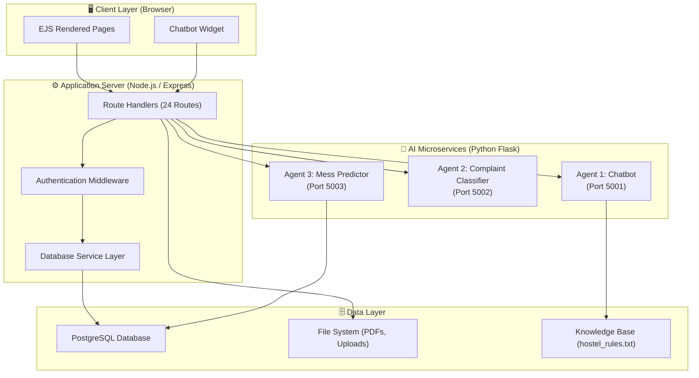
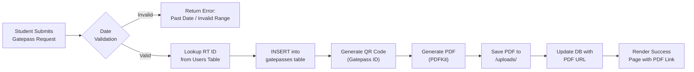
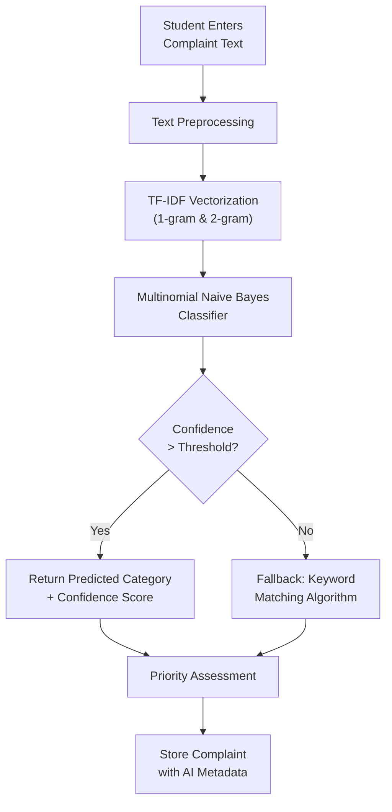
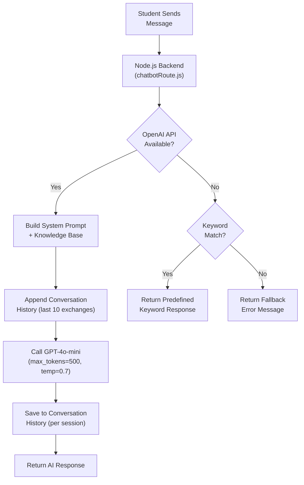
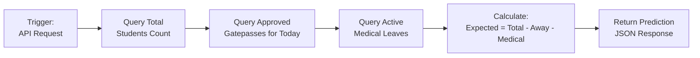
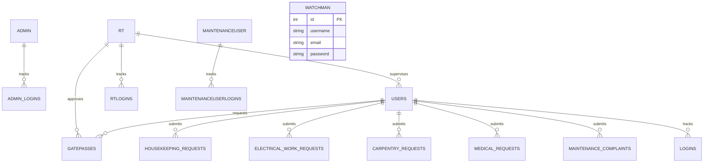
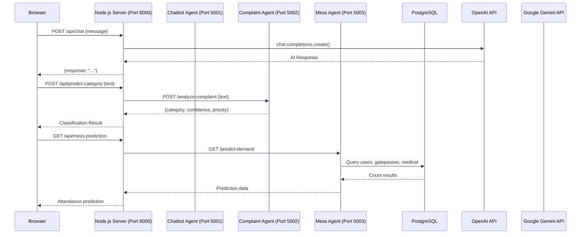
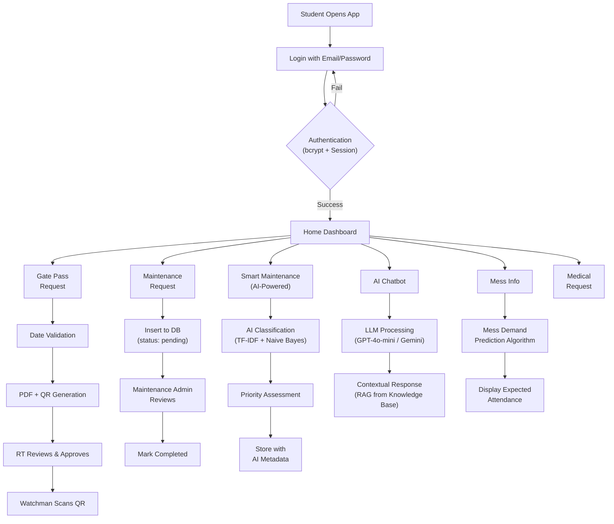

# 📘 Algorithm & Methodology – KBA Men's Hostel Management System

> [!NOTE]
> This document describes the complete algorithm, methodology, and process flow of the **KBA Men's Hostel Management System** — an AI-powered web application for end-to-end digital hostel operations management.

---

## 1. System Overview

The KBA Hostel Management System is a **full-stack web application** built using a **multi-tier client–server architecture** with integrated **AI/ML microservices**. It digitizes and automates core hostel operations including gate pass management, maintenance complaint handling, mess demand prediction, and 24/7 student support via an intelligent chatbot.

### Technology Stack

| Layer | Technology |
|---|---|
| **Frontend** | EJS Templates, HTML5, CSS3, JavaScript |
| **Backend** | Node.js, Express.js (ES Modules) |
| **Database** | PostgreSQL (via `pg` connection pool) |
| **AI/ML Services** | Python Flask microservices (Scikit-learn, Google Gemini, OpenAI GPT-4o-mini) |
| **Security** | bcrypt password hashing, Express Session-based authentication |
| **Document Generation** | PDFKit, QRCode |
| **Email Service** | Nodemailer |

---

## 2. System Architecture



---

## 3. Algorithm & Process Flows

### 3.1 Authentication & Authorization Algorithm

The system implements a **role-based access control (RBAC)** mechanism with five distinct user roles:

| Role | Table | Panel | Auth Middleware |
|---|---|---|---|
| Student | `users` | Home / Gatepass / Services | `checkAuthenticated` |
| Management Admin | `admin` | Management Admin Panel | `checkManagementAdminAuthenticated` |
| Maintenance Admin | `maintenanceuser` | Maintenance Admin Panel | `checkMaintenanceAdminAuthenticated` |
| Resident Tutor (RT) | `rt` | RT Admin Panel | `checkRtAdminAuthenticated` |
| Watchman | `watchman` | Watchman Panel | `checkWatchmanAuthenticated` |

#### Login Algorithm (Student)

```
ALGORITHM: Student Login
INPUT: email, password
OUTPUT: Authenticated session OR error message

1. QUERY database: SELECT * FROM users WHERE email = input_email
2. IF no user found:
     RETURN "Email not found"
3. ELSE:
     stored_hash ← user.password
     result ← bcrypt.compare(input_password, stored_hash)
     IF result == TRUE:
         SET session.isAuthenticated = true
         SET session.user = { email, name, rrn }
         INSERT INTO logins (email) VALUES (input_email)   // Track login
         REDIRECT to Home "/"
     ELSE:
         RETURN "Incorrect password"
```

#### Registration Algorithm

```
ALGORITHM: User Registration (via Management Admin)
INPUT: name, rrn, email, password, parent_email, parent_mob_num, student_mob_num, rtid
OUTPUT: New user record OR error

1. CHECK if email already exists in users table
2. CHECK if rrn already exists in users table
3. IF either exists:
     RETURN error "Already exists"
4. ELSE:
     hashed_password ← bcrypt.hash(password, salt_rounds=10)
     INSERT INTO users (...) VALUES (..., hashed_password, ...)
     REDIRECT to Admin Panel
```

#### Middleware Authentication Flow

```
ALGORITHM: Route Protection Middleware
INPUT: HTTP Request
OUTPUT: NEXT() or REDIRECT to login

FOR Student routes:
  IF session.isAuthenticated == true → NEXT()
  ELSE → REDIRECT "/login"

FOR Admin routes (Management/Maintenance/RT/Watchman):
  IF session.{role} exists AND session.{role}.role == expected_role:
    IF path == login_page → REDIRECT to panel (prevent re-login)
  ELSE → NEXT() (allow access to login page)
```

---

### 3.2 Gate Pass Management Algorithm

The gate pass system follows a **request → approval → PDF generation → QR verification** pipeline.



#### Gatepass Request Algorithm

```
ALGORITHM: Gate Pass Request Processing
INPUT: name, rrn, degree, block_room, time_out, time_in, reason, contacts, rt_name
OUTPUT: Generated PDF with QR code

1. VALIDATE dates:
   a. time_out MUST be in the future (> NOW)
   b. time_in MUST be in the future (> NOW)
   c. time_in MUST be after time_out

2. LOOKUP rtid:
   QUERY: SELECT rtid FROM users WHERE rrn = input_rrn
   IF no result → RETURN "No RT found for given RRN"

3. INSERT gatepass record into database
   → RETURNING id (auto-generated gatepass ID)

4. GENERATE QR Code:
   data ← gatepassId.toString()
   qrCodeDataUrl ← QRCode.toDataURL(data)

5. GENERATE PDF Document:
   a. Create PDF with PDFKit
   b. Draw page border
   c. Add institutional logo (fetched via HTTP from external URL)
   d. Add all gatepass fields as labeled rows
   e. Embed QR code image at bottom-right corner
   f. Save PDF to /uploads/Gatepass_{rrn}_{timestamp}.pdf

6. UPDATE database: SET pdf_url for this gatepass record

7. RENDER success page with download link
```

#### Gatepass Approval Workflow (RT Admin)

```
ALGORITHM: Gatepass Approval by RT
INPUT: gatepass_id, action (approve/reject)

1. RT Admin views pending gatepasses filtered by their rtid
   QUERY: SELECT * FROM gatepasses WHERE rtid = session.rtadmin.rtid

2. RT reviews the request details

3. ON action:
   IF approve → UPDATE gatepasses SET status = 'approved', approved_at = NOW() WHERE id = gatepass_id
   IF reject → UPDATE gatepasses SET status = 'rejected' WHERE id = gatepass_id

4. Watchman verifies QR code at gate:
   SCAN QR → Extract gatepass_id
   QUERY: SELECT * FROM gatepasses WHERE id = scanned_id
   IF status == 'approved' → Allow departure, UPDATE status = 'departed'
```

---

### 3.3 AI-Powered Smart Maintenance System

This is the core AI module using **NLP-based text classification** for automatic complaint categorization.

#### 3.3.1 Complaint Classification Algorithm (TF-IDF + Naive Bayes)



#### Training Phase Algorithm

```
ALGORITHM: NLP Model Training (Complaint Classification)
INPUT: Labeled training data (category → example phrases)

CATEGORIES = ['electrical', 'plumbing', 'housekeeping', 'carpentry', 'medical', 'other']

TRAINING DATA (samples per category):
  electrical  → ["fan not working", "light fused", "switch burnt", "power cut", ...]
  plumbing    → ["leakage", "tap broken", "no water", "flush problem", ...]
  housekeeping→ ["dirty room", "garbage not picked", "pest control", ...]
  carpentry   → ["door lock broken", "window hinge", "table repair", ...]
  medical     → ["fever", "accident", "first aid", "doctor visit", ...]
  other       → ["wifi slow", "mess food", "noise complaint", ...]

1. FOR each category in TRAINING_DATA:
     FOR each example in category:
       texts.append(example.lower())
       labels.append(category)

2. BUILD ML Pipeline:
   Pipeline = [
     Step 1: TfidfVectorizer(ngram_range=(1,2), max_features=1000)
     Step 2: MultinomialNB(alpha=0.1)  // Laplace smoothing
   ]

3. pipeline.fit(texts, labels)
```

> [!IMPORTANT]
> **TF-IDF (Term Frequency–Inverse Document Frequency)** converts text into numerical feature vectors. Combined with **Multinomial Naive Bayes**, it forms a lightweight yet effective text classification pipeline.

#### Prediction Phase Algorithm

```
ALGORITHM: Complaint Analysis & Classification
INPUT: raw_complaint_text (string from student)
OUTPUT: { category, confidence, priority, sentiment }

1. PREPROCESS text:
   a. Convert to lowercase
   b. Remove all non-alphabetic characters (regex: [^a-zA-Z\s])
   c. Normalize whitespace

2. PREDICT category:
   prediction ← pipeline.predict([processed_text])[0]
   probabilities ← pipeline.predict_proba([processed_text])[0]
   confidence ← round(max(probabilities) × 100, 2)

3. ASSESS priority using Keyword Matching:
   urgent_keywords = ['emergency', 'urgent', 'immediately', 'danger',
                       'shock', 'fire', 'flooded', 'bleeding', 'unconscious']
   is_urgent ← ANY keyword IN processed_text

4. DETERMINE priority and sentiment:
   IF is_urgent:
     priority = 'high', sentiment = 'urgent'
   ELSE IF confidence < 60:
     priority = 'normal', sentiment = 'neutral'
   ELSE:
     priority = 'medium', sentiment = 'negative'

5. RETURN { category, confidence, priority, sentiment }
```

#### Local Fallback Algorithm (When ML Service is Unavailable)

```
ALGORITHM: Keyword-Based Fallback Classifier
INPUT: complaint_text
OUTPUT: { category, confidence, priority, sentiment }

1. DEFINE keyword dictionaries per category:
   electrical   → [fan, light, switch, power, electricity, ac, bulb, socket, wire]
   plumbing     → [water, tap, pipe, drain, toilet, leak, flush, geyser]
   housekeeping → [clean, dirty, dust, garbage, sweep, mop, pest, cockroach]
   carpentry    → [door, window, furniture, table, chair, lock, cupboard, shelf]
   medical      → [sick, fever, medicine, doctor, health, pain, injury, emergency]

2. FOR each category:
     score ← COUNT of keywords found in text
     TRACK category with highest score

3. IF maxScore > 0:
     confidence ← min(50 + maxScore × 15, 95)
     predicted ← category with highest score
   ELSE:
     confidence ← 30
     predicted ← 'other'

4. MAP category → department (e.g., electrical → "Electrical Maintenance Team")

5. RETURN result with generated probability distribution
```

#### Smart Maintenance Database Storage

```
ALGORITHM: Store AI-Enhanced Complaint
INPUT: student_data + AI_analysis_results

1. INSERT INTO maintenance_complaints:
   - Student Info: name, rrn, block, room_number
   - Complaint: description, user-selected category
   - AI Data: ai_predicted_category, ai_confidence, priority, sentiment
   - Status: 'pending'
   - Timestamps: created_at = NOW()

2. IF table doesn't exist (error code 42P01):
   CREATE TABLE maintenance_complaints (...)
   RETRY insert

3. RETURN complaint ID to student
```

---

### 3.4 AI Chatbot Algorithm (LLM-Based)

The chatbot uses a **Retrieval-Augmented Generation (RAG)** approach with a local knowledge base and large language model.



#### Chatbot Processing Algorithm

```
ALGORITHM: AI Chatbot Response Generation
INPUT: user_message, session_id
OUTPUT: assistant_response

1. LOAD Knowledge Base:
   hostel_rules ← READ 'hostel_rules.txt'
   (Contains: mess timings, curfew rules, contact info, facilities, etc.)

2. BUILD System Prompt:
   system_prompt = """
   Role: KBA Hostel Virtual Assistant
   Rules:
     - Answer hostel queries using knowledge base
     - Be polite and concise (2-4 sentences)
     - For unknown queries, suggest contacting Warden
     - For emergencies, provide emergency contacts
     - Never fabricate information
   Knowledge Base: {hostel_rules}
   """

3. MANAGE Conversation History:
   IF session_id NOT in conversationHistories:
     CREATE empty history for session
   history ← conversationHistories[session_id]
   recent_history ← last 20 messages (= 10 Q&A exchanges)

4. CONSTRUCT API Messages:
   messages = [
     { role: "system", content: system_prompt },
     ...recent_history,
     { role: "user", content: user_message }
   ]

5. CALL OpenAI API:
   completion ← openai.chat.completions.create(
     model: "gpt-4o-mini",
     messages: messages,
     max_tokens: 500,
     temperature: 0.7
   )
   response ← completion.choices[0].message.content

6. UPDATE History:
   history.push({ role: "user", content: user_message })
   history.push({ role: "assistant", content: response })
   IF history.length > 30 → TRIM to last 20 entries

7. RETURN response

FALLBACK (if API unavailable):
   Match keywords in message:
   - "gate pass" / "leave" → Gate pass info
   - "mess" / "food"       → Mess timing info
   - "medical" / "doctor"  → Medical facility info
   - "wifi" / "internet"   → WiFi info
   - "rule" / "curfew"     → Hostel rules
   etc.
```

---

### 3.5 Mess Demand Prediction Algorithm

This system predicts daily meal attendance to reduce food waste.



#### Mess Prediction Algorithm

```
ALGORITHM: Smart Mess Demand Prediction
INPUT: current_date (today)
OUTPUT: { totalStudents, awayOnGatepass, onMedicalLeave, expectedAttendance }

1. QUERY total registered students:
   total_students ← SELECT COUNT(*) FROM users

2. QUERY students away on approved gatepass TODAY:
   away_gatepass ← SELECT COUNT(*) FROM gatepasses
                    WHERE status = 'approved'
                    AND today >= time_out::date
                    AND today <= time_in::date

3. QUERY students on active medical leave:
   medical_leaves ← SELECT COUNT(*) FROM medical_requests
                     WHERE status IN ('pending', 'in-progress')

4. CALCULATE expected attendance:
   expected = total_students - (away_gatepass + medical_leaves)
   expected = MAX(0, expected)   // Ensure non-negative

5. RETURN {
     totalStudents: total_students,
     awayOnGatepass: away_gatepass,
     onMedicalLeave: medical_leaves,
     expectedAttendance: expected
   }
```

> [!TIP]
> The mess prediction uses real-time database queries rather than historical ML models, making it a **rule-based prediction** system. It considers two subtraction factors: approved gatepasses (students physically absent) and active medical cases (students unlikely to attend meals).

---

### 3.6 Maintenance Request Processing Algorithm (Traditional)

For standard (non-AI) service requests: Housekeeping, Electrical, Carpentry, Medical.

```
ALGORITHM: Service Request Lifecycle
INPUT: Student submits form (name, rrn, block, room, complaint details)
OUTPUT: Request tracked through complete lifecycle

PHASE 1 — SUBMISSION:
  1. Student selects service type (housekeeping / electrical / carpentry / medical)
  2. Form auto-fills name, rrn from session
  3. Student provides block, room, and complaint description
  4. INSERT INTO {service}_requests (...) VALUES (...)
     status = 'pending', maintenance_done = 'No'

PHASE 2 — ADMIN REVIEW (Maintenance Admin Panel):
  1. Admin views all pending requests:
     SELECT * FROM {service}_requests WHERE status = 'pending'
  2. Admin assigns staff or updates status

PHASE 3 — COMPLETION:
  1. Admin marks request as completed:
     UPDATE {service}_requests
     SET maintenance_done = 'Yes', status = 'completed', completed_at = NOW()
     WHERE id = request_id

PHASE 4 — REPORTING (Management Admin Panel):
  1. Management admin views all completed requests across all categories
  2. Dashboard aggregates data for oversight
```

---

### 3.7 Password Recovery Algorithm

```
ALGORITHM: Forgot Password Flow (Email-based OTP)
INPUT: user_email
OUTPUT: Password reset or error

1. User enters registered email
2. QUERY database to verify email exists
3. IF exists:
     Generate cryptographic token: crypto.randomBytes(32).toString('hex')
     Store token with expiry time (typically 1 hour)
     Send reset email via Nodemailer:
       - SMTP: Gmail (safinmohamed2004@gmail.com)
       - Body: Reset link with token
4. User clicks reset link
5. VALIDATE token (exists + not expired)
6. User enters new password
7. Hash new password: bcrypt.hash(newPassword, 10)
8. UPDATE user record with new hashed password
9. Invalidate token
10. REDIRECT to login page
```

---

## 4. Database Design Methodology

### Entity-Relationship Summary



### Key Tables

| Table | Purpose | Records |
|---|---|---|
| `users` | Student residents | Name, RRN, email, password, block, room, RT assignment |
| `admin` | Management admins | Full hostel oversight |
| `rt` | Resident Tutors | Gatepass approval authority |
| `maintenanceuser` | Maintenance admins | Service request management |
| `watchman` | Security staff | QR-based gate verification |
| `gatepasses` | Gate pass requests | Full lifecycle with PDF/QR links |
| `housekeeping_requests` | Cleaning requests | Status-tracked service requests |
| `electrical_work_requests` | Electrical work | Status-tracked service requests |
| `carpentry_requests` | Carpentry work | Status-tracked service requests |
| `medical_requests` | Medical assistance | Doctor notes, service tracking |
| `maintenance_complaints` | AI-analyzed complaints | Includes AI predictions, confidence, sentiment |
| `logins` / `*_logins` | Audit trail | Login timestamp tracking per role |

### Indexing Strategy

```sql
-- Performance-optimized indexes on frequently queried columns
CREATE INDEX idx_users_rrn ON users(rrn);
CREATE INDEX idx_users_email ON users(email);
CREATE INDEX idx_gatepasses_rrn ON gatepasses(rrn);
CREATE INDEX idx_gatepasses_status ON gatepasses(status);
CREATE INDEX idx_gatepasses_rtid ON gatepasses(rtid);
CREATE INDEX idx_housekeeping_status ON housekeeping_requests(status);
CREATE INDEX idx_electrical_status ON electrical_work_requests(status);
CREATE INDEX idx_carpentry_status ON carpentry_requests(status);
CREATE INDEX idx_medical_status ON medical_requests(status);
CREATE INDEX idx_maintenance_complaints_status ON maintenance_complaints(status);
CREATE INDEX idx_maintenance_complaints_category ON maintenance_complaints(category);
```

---

## 5. Microservice Communication Architecture



### Resilience Pattern: Graceful Degradation

Each AI service implements a **fallback mechanism**:

| Service | Primary | Fallback |
|---|---|---|
| Chatbot | OpenAI GPT-4o-mini API | Keyword-based response matching |
| Complaint Classifier | Python ML Agent (Port 5002) | Local keyword scoring algorithm (Node.js) |
| Mess Prediction | Python Agent (Port 5003) | Direct PostgreSQL queries from Node.js |

---

## 6. Security Methodology

| Aspect | Implementation |
|---|---|
| **Password Storage** | bcrypt hashing with 10 salt rounds |
| **Session Management** | Express-session with HTTP-only cookies |
| **Route Protection** | Role-based middleware guards on all protected routes |
| **SQL Injection Prevention** | Parameterized queries (`$1, $2, ...`) throughout |
| **Input Validation** | Server-side date validation for gatepasses |
| **Login Auditing** | Separate login tracking tables per role |

---

## 7. Process Summary — End-to-End Workflow



---

## 8. Summary of Algorithms Used

| # | Algorithm / Technique | Module | Purpose |
|---|---|---|---|
| 1 | **bcrypt Hashing** | Authentication | Secure password storage with salted hashing |
| 2 | **Session-based RBAC** | Middleware | Role-based access control for 5 user types |
| 3 | **TF-IDF Vectorization** | Smart Maintenance (ML) | Convert complaint text to numerical feature vectors |
| 4 | **Multinomial Naive Bayes** | Smart Maintenance (ML) | Probabilistic text classification for complaint categories |
| 5 | **Keyword-based Scoring** | Smart Maintenance (Fallback) | Rule-based classification when ML service is unavailable |
| 6 | **Urgent Keyword Detection** | Priority Assessment | Pattern matching for emergency escalation |
| 7 | **RAG (Retrieval-Augmented Generation)** | AI Chatbot | LLM grounded with hostel knowledge base context |
| 8 | **Conversation History Management** | AI Chatbot | Sliding window of recent exchanges for context continuity |
| 9 | **Rule-based Subtraction Model** | Mess Prediction | Expected attendance = Total − Gatepasses − Medical leaves |
| 10 | **QR Code Encoding/Decoding** | Gate Pass | Unique gatepass ID encoded for physical verification |
| 11 | **PDF Document Generation** | Gate Pass | Automated formatted document creation with PDFKit |
| 12 | **Cryptographic Token Generation** | Password Recovery | Secure random token for email-based password reset |
| 13 | **Graceful Degradation Pattern** | All AI Services | Automatic fallback when external services are unavailable |
